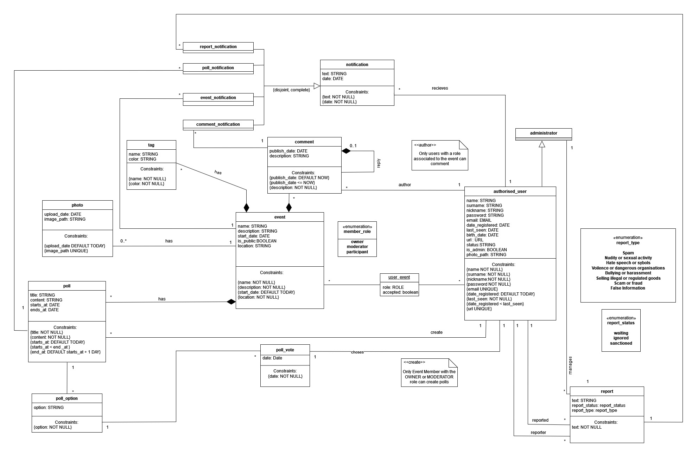

# EBD: Database Specification Component

***UPortoEvent*** will able all students of "Universidade do Porto" to explore all sorts of events inside their academic environment. Therefore in these three artifacts we will present our Database for this project. This way you'll see how your data will be stored.

## A4: Conceptual Data Model

In A4 we will take over our first database topic. This will cover the **Class Diagram** which compiles all entities, attributes and relations of our database, in order to store efficiently all website information.

### 1. Class diagram

### 2. Additional Business Rules
 
- BR01 : Only registred users who participate on the event can make comments and answer to polls.
- BR02 : Only Participants of an specific event can vote in polls
---

## A5: Relational Schema, validation and schema refinement

In A5 we are going to interpretate de UML diagram into the Relational Schema, so that SQL code turns out better. This more specific model represets out data base less abstract in a more concise way.

### 1. Relational Schema

| Relation reference | Relation Compact Notation                        |
| ------------------ | ------------------------------------------------ |
| R01                | authorized_user(<ins>user_id</ins>, firstname **NN**, lastname **NN**, username **NN**, password **NN**, email **UK** **NN**, date_registered, birth_date **NN**, url **UK** **NN**, status, is_admin, photo_path ) |
| R02                | event(<ins>event_id</ins>, name **NN**, description **NN**, start_date **NN**, location **NN**, is_public **NN**, role **DF** 'participant' **CK** (role **IN** member_role)) ) |
| R03                | notification(<ins>notification_id</ins>, text **NN**, date **NN**, #user_id → authorized_user **NN** ) |
| R04                | photo(<ins>photo_id</ins>, upload_date **NN**, image_path **NN**, #event_id → Event ) |
| R05				 | poll(<ins>poll_id</ins>, question **NN**, content **NN**, start_date **NN**, end_date **NN**, #user_id → authorized_user **NN**, #event_id → event **NN** ) |
| R06				 | poll_choice(<ins>poll_choice_id</ins>, choice **NN**, #poll_id → poll **NN**) |
| R07   			 | comment(<ins>comment_id</ins>, publish_date **NN**, description **NN**, #comment_id → comment **NN**, #event_id → event **NN**, #user_id → authorized_user **NN** ) |
| R08    			 | tag(<ins>tag_id</ins>, name **NN**, color **NN**, #event_id → event **NN** ) |
| R09  			     | poll_vote(<ins>vote_id</ins>, date **NN**, #user_id → authorized_user **NN**, #poll_choice_id → poll_choice **NN** ) |
| R10 				 | report(<ins>report_id</ins>, text **NN**, report_status **DF** 'waiting' **CK** (report_status **IN** report_status), report_type **DF** 'Spam' **CK** (report_type **IN** report_type), reported → authorized_user **NN**, reporter → authorized_user **NN**, manages → administrator **NN**) |
| R11                | user_event(<ins>user_id → authorized_user</ins>,<ins>event_id → event</ins>, accepted) |
| R12                | administrator(<ins>#user_id → authorized_user</ins>) |
| R13                | report_notification(<ins>#notification_id → Notification **NN**</ins>, #report → Report **NN**) |
| R14                | poll_notification(<ins>#notification_id → Notification **NN**</ins>, #poll → Poll **NN**) |
| R15                | event_notification(<ins>#notification_id → Notification **NN**</ins>, #event → Event **NN**) |
| R16                | comment_notification(<ins>#notification_id → Notification **NN**</ins>, #comment → Comment **NN**) |

### 2. Domains

| Domain Name  | Domain Specification           |
| -----------  | ------------------------------ |
| member_role   | ENUM ('owner', 'moderator', 'participant') |
| report_type | ENUM ('Spam', 'Nudity or sexual activity', 'Hate speech or symbols', 'Violence or dangerous organisations', 'Bullying or harassment', 'Selling illegal or regulated goods', 'Scams or fraud', 'False information', 'other') |
| report_status | ENUM('waiting', 'ignored', 'sanctioned')|

### 3. Schema validation

| **TABLE R01**   | authorized_user     |
| --------------  | ---                |
| **Keys**        | { user_id }, { email }, {url}  |
| **Functional Dependencies:** |       |
| FD0101          | user_id → {full_name, nickname, password, email, date_registered, last_seen, birth_date, url, status, is_admin, photo_path} |
| FD0102          | email → {user_id, name, surname, nickname, password, date_registered, last_seen, birth_date, url, status, is_admin, photo_path} |
| FD0103          | url → {user_id, name, surname, nickname, password, email, date_registered, last_seen, birth_date, status, is_admin, photo_path}  |         |
| **NORMAL FORM** | BCNF               |

| **TABLE R02**   | event              |
| --------------  | ---                |
| **Keys**        | {event_id}         |
| **Functional Dependencies:** |       |
| FD0201          | event_id → {name, description, start_date, location, is_public} |
| **NORMAL FORM** | BCNF               |

| **TABLE R03**   | notification       |
| --------------  | ---                |
| **Keys**        | {notification_id}  |
| **Functional Dependencies:** |       |
| FD0301          | notification_id → {text, date, user_id} |
| **NORMAL FORM** | BCNF               |

| **TABLE R04**   | photo              |
| --------------  | ---                |
| **Keys**        | { photo_id}        |
| **Functional Dependencies:** |       |
| FD0401          | photo_id → {upload_date, image_path, event_id} |
| **NORMAL FORM** | BCNF               |

| **TABLE R05**   | poll               |
| --------------  | ---                |
| **Keys**        | { poll_id }        |
| **Functional Dependencies:** |       |
| FD0501          | poll_id → {question, content, start_date, end_date, user_id, event_id} |
| **NORMAL FORM** | BCNF               |

| **TABLE R06**   | poll_choice         |
| --------------  | ---                |
| **Keys**        | { poll_choice_id }     |
| **Functional Dependencies:** |       |
| FD0601          | poll_choice_id → {choice, poll_id} |
| **NORMAL FORM** | BCNF               |

| **TABLE R07**   | comments            |
| --------------  | ---                |
| **Keys**        | { comment_id } |
| **Functional Dependencies:** |       |
| FD0701          | comment_id → {publish_date, description, comment_id, event_id, user_id} |
| **NORMAL FORM** | BCNF               |

| **TABLE R08**   | tag                |
| --------------  | ---                |
| **Keys**        | { tag_id } |
| **Functional Dependencies:** |       |
| FD0801          | tag_id → {name, color, event_id} |
| **NORMAL FORM** | BCNF               |

| **TABLE R09**   | poll_vote               |
| --------------  | ---                |
| **Keys**        | { vote_id } |
| **Functional Dependencies:** |       |
| FD0901          | vote_id → {date, user_id, poll_choice_id} |
| **NORMAL FORM** | BCNF               |

| **TABLE R10**   | report             |
| --------------  | ---                |
| **Keys**        | { report_id }|
| **Functional Dependencies:** |       |
| FD1001          | report_id → {text, report_status, report_type, reported, reporter, manages} |
| **NORMAL FORM** | BCNF               |

| **TABLE R11**   | user_event         |
| --------------  | ---                |
| **Keys**        | { user_id }, { event_id }  |
| **Functional Dependencies:** |       |
| FD1701          | user_id, member_role, event_id → {accepted} |
| **NORMAL FORM** | BCNF               |

| **TABLE R12**   | administrator      |
| --------------  | ---                |
| **Keys**        | { user_id }        |
| **Functional Dependencies:** |       |
| FD1801          | none               |
| **NORMAL FORM** | BCNF               |

| **TABLE R13**   | report_notification|
| --------------  | ---                |
| **Keys**        | { notification_id }  |
| **Functional Dependencies:** |       |
| FD1201          | notification_id → {report_id} |
| **NORMAL FORM** | BCNF               |

| **TABLE R14**   | poll_notification  |
| --------------  | ---                |
| **Keys**        | { notification_id }  |
| **Functional Dependencies:** |       |
| FD1301          | notification_id → {poll_id}  |
| **NORMAL FORM** | BCNF               |

| **TABLE R15**   | event_notification |
| --------------  | ---                |
| **Keys**        | { notification_id } |
| **Functional Dependencies:** |       |
| FD1401          | notification_id → {event_id} |
| **NORMAL FORM** | BCNF               |

| **TABLE R16**   |comment_notification|
| --------------  | ---                |
| **Keys**        | { notification_id } |
| **Functional Dependencies:** |       |
| FD1501          | notification_id → {comment_id} |
| **NORMAL FORM** | BCNF               |

The Schema is already in BCNF. Every relation is in BCNF (Boyce-Codd Normal Form).

### Annex A. SQL Code
The SQL script that contains the creation statements, cleans up the current database state (Drops).

**A.1 Database Schema**

**Caveat:** In order to run the script administator permissions might be required to create extensions.

[A5.sql](https://git.fe.up.pt/lbaw/lbaw2223/lbaw22122/-/blob/main/Docs/EBD/schemaA5.sql)

## A6: Indexes, triggers, transactions and database population

This artifact contains information about workload of the  database, the identification and characterisation of the indexes, triggers and transaction to support the data integrity rules and the physical schema of the complete database.

### 1. Database Workload
 
Understanding the potential load on databases and the speed of their growth will help creating well structured and dedicated database design for fast and stable work of the service. Database workload includes an estimate of the number of tuples for each relation and the estimated growth.\
The designation 1+ means several, 10+ means tens, 100+ means hundreds, and so on.

| **Relation reference** | **Relation Name** | **Order of magnitude**        | **Estimated growth** |
| ------------------ | ------------- | ------------------------- | -------- |
| R01  | authorized_user 	| 10.000+   | 10+  |
| R02  | event          	| 1.000+ 	| 1+   |
| R03  | notification   	| 10.000+	| 10+  |
| R04  | photo          	| 10.000+	| 10+  |
| R05  | poll		    	| 1.000+ 	| 1+   |
| R06  | poll_choice     	| 1.000+ 	| 1+   |
| R07  | comment        	| 10.000+ 	| 10+  |
| R08  | tag        		| 1000+		| 1+   |
| R09  | vote        		| 1.000+ 	| 1+   |
| R10  | report      		| 100+		| 1+   |
| R11  | user_event    		| 10.000+   | 10+  |
| R12  | administrator      | 10+       | 1+   |

### 2. Proposed Indices

Indexes are used to improve database performance by allowing the database server to work with certain rows much faster. Once an index is created, the system must keep it in sync with the table, which increases the load on data processing operations. Because indexes add to the load on the database system, we should try not to overuse them.

#### 2.1. Performance Indices

| **Index**           | IDX01                                  |
| ---                 | ---                                    |
| **Relation**        | event    				       |
| **Attribute**       | date								   |
| **Type**            | b-tree             					   |
| **Cardinality**     | medium                                   |
| **Clustering**      | No                                     |
| **Justification**   |  This index is for searching an event according to is start_date and is to be executed many times so it must be fast. |
| **SQL code**		  |`CREATE INDEX idx_event_date ON "event" USING btree(start_date);` |

| **Index**           | IDX02                                  |
| ---                 | ---                                    |
| **Relation**        | comments    						   |
| **Attribute**       | event_id, comment_text							   |
| **Type**            | b-tree             					   |
| **Cardinality**     | medium                                 |
| **Clustering**      | Yes                                     |
| **Justification**   | The main purpose of this index is to ease the search of comments associated with an specific event. Cardinality is medium because event_id can be repeated. | 
| **SQL code**		  |`CREATE INDEX idx_comment ON comments USING btree(event_id, comment_text);` |

#### 2.2. Full-text Search Indices 

| **Index**           | IDX11                                  |
| ---                 | ---                                    |
| **Relation**        | event    |
| **Attribute**       | name, description, location   |
| **Type**            | GIN              |
| **Clustering**      | NO                |
| **Justification**   | To provide full-text search features search for events based on name, description and location. The index type is GIN because the indexed fields are not expected to change often.   |

SQL IDX11 CODE:
~~~~sql
ALTER TABLE event
ADD COLUMN IF NOT EXISTS tsvectors TSVECTOR;

CREATE OR REPLACE FUNCTION event_search_update() RETURNS TRIGGER AS $$
BEGIN
 IF TG_OP = 'INSERT' THEN
        NEW.tsvectors = (
         setweight(to_tsvector('english', NEW.name), 'A') ||
         setweight(to_tsvector('english', NEW.description), 'B') ||
                 setweight(to_tsvector('english', NEW.location), 'C')
        );
 END IF;
 IF TG_OP = 'UPDATE' THEN
         IF (NEW.name <> OLD.name OR NEW.description <> OLD.description OR NEW.location <> OLD.location) THEN
           NEW.tsvectors = (
             setweight(to_tsvector('english', NEW.name), 'A') ||
         setweight(to_tsvector('english', NEW.description), 'B') ||
                 setweight(to_tsvector('english', NEW.location), 'C')
           );
         END IF;
 END IF;
 RETURN NEW;
END $$
LANGUAGE plpgsql;

DROP TRIGGER IF EXISTS event_search_update ON event;

CREATE TRIGGER event_search_update
 BEFORE INSERT OR UPDATE ON event
 FOR EACH ROW
 EXECUTE PROCEDURE event_search_update();

DROP INDEX IF EXISTS search_idx_event CASCADE;
CREATE INDEX IF NOT EXISTS search_idx_event ON event USING GIN (tsvectors);

~~~~

### 3. Triggers
 

| **Trigger**      | TRIGGER01                              |
| ---              | ---                                    |
| **Description**  | Sends a notification after user submits a report to assure him it's delivered. |

SQL TRIGGER01 CODE:
~~~~sql
CREATE OR REPLACE FUNCTION report_notification() RETURNS trigger AS $report_notification$ 
BEGIN 
	INSERT INTO 
	notification(user_id, notification_type, notification_date, notification_text) 
	select NEW.reporter_id, 'report', NEW.report_date, 'Thank you for your report. 
	We will check information given as fast as possible. Report status: ' || NEW.report_status || ' Message: ' || NEW.report_text from report; 
RETURN new; 
END; 
$report_notification$ 
language plpgsql; 
				
DROP TRIGGER IF EXISTS trig_report ON public.report; 
											
CREATE TRIGGER trig_report					
AFTER INSERT ON report						
FOR EACH ROW								
EXECUTE PROCEDURE report_notification();` 
~~~~

| **Trigger**      | TRIGGER02                              |
| ---              | ---                                    |
| **Description**  | Sends a notification after a new poll is created|

SQL TRIGGER02 CODE:
~~~~sql
CREATE OR REPLACE FUNCTION poll_notification() RETURNS trigger AS $poll_notification$
BEGIN
	INSERT INTO 
	notification(notification_date, notification_type, user_id, notification_text)
	select NEW.starts_at, 'poll', NEW.user_id, 'New poll was created. ' || NEW.title || ' You can vote!' from poll;
RETURN new;
END;
$poll_notification$
language plpgsql;
				
DROP TRIGGER IF EXISTS trig_poll ON public.poll;

CREATE TRIGGER trig_poll
     AFTER INSERT ON poll
     FOR EACH ROW
     EXECUTE PROCEDURE poll_notification();
~~~~

| **Trigger**      | TRIGGER03                              |
| ---              | ---                                    |
| **Description**  | Sends a notification when a user joins an event. |

SQL TRIGGER03 CODE:
~~~~sql 
CREATE OR REPLACE FUNCTION event_notification() RETURNS trigger AS $event_notification$
BEGIN
	INSERT INTO 
	notification(notification_text,notification_date, notification_type, user_id)
	VALUES('You have just joined new event, welcome!', CURRENT_TIMESTAMP, 'event', NEW.user_id);
RETURN new;
END;
$event_notification$
language plpgsql;
				
DROP TRIGGER IF EXISTS trig_event ON public.user_event;

CREATE TRIGGER trig_event
     AFTER INSERT OR UPDATE ON user_event
     FOR EACH ROW
     EXECUTE PROCEDURE event_notification();
~~~~

| **Trigger**      | TRIGGER04                              |
| ---              | ---                                    |
| **Description**  | Sends a notification to the creator of a comment when a comment is replied by another user. |

SQL TRIGGER03 CODE:
~~~~sql 
CREATE OR REPLACE FUNCTION comment_notification() RETURNS trigger AS $comment_notification$
BEGIN
	IF (NEW.parent_comment_id IS NOT NULL)
THEN
	INSERT INTO 
	notification(notification_text,notification_date, notification_type, user_id)
	select NEW.comment_text, NEW.comment_date, 'comment' ,user_id from comments where NEW.parent_comment_id = id;
END IF;
RETURN new;
END;
$comment_notification$
language plpgsql;
				
DROP TRIGGER IF EXISTS trig_comment ON public.comments;

CREATE TRIGGER trig_comment
     AFTER INSERT OR UPDATE ON comments
     FOR EACH ROW
     EXECUTE PROCEDURE comment_notification();
~~~~

| **Trigger**      | TRIGGER05                              |
| ---              | ---                                    |
| **Description**  | When name/surename inserted into authorized_user table, the trigger capitalizes the fisrt letter. |
| **Priority US**  | Medium                                 |

### 4. Transactions
 
> Transactions needed to assure the integrity of the data.  

| SQL Reference   | TRAN01                      |
| --------------- | ----------------------------------- |
| Description     | Create a new event          |
| Justification   | When user tries to create a new event it's important to use a transaction to ensure that all the code executes without errors. If an error occurs, a ROLLBACK is issued (when the insertion of new event fails or creation of new line in the user_event). The isolation level is Repeatable Read, because, otherwise, there is a chance that event_update table can be changed by other function and as a result, inconsistent data would be stored.  |
| Isolation level | REPEATABLE READ |

~~~~sql
BEGIN TRANSACTION;

SET TRANSACTION ISOLATION LEVEL REPEATABLE READ;
-- event
INSERT INTO event (name, description, start_date, is_public, location)
 VALUES ($name, $description, GETDATE(), $is_public, $location);

-- user_event
INSERT INTO user_event (role, accepted)
 VALUES ('Owner', TRUE);

END TRANSACTION; 
~~~~

### Annex A. SQL Code
SQL script in included. It cintains the creation statements, cleans up the current database state 'The SQL script is cleaned (e.g. excluded from export comments)' - don't understand what does it mean. Indexes, triggers, transactions and database population - to be provided at A6.

## A.1 Database Schema

The SQL creation script is expanded in the A6 to include indexes, triggers, and transactions.

**Caveat:** In order to run the script administator permissions might be required to create extensions.

[A6.sql](https://git.fe.up.pt/lbaw/lbaw2223/lbaw22122/-/blob/main/Docs/EBD/schemaA6.sql)

### A.2. Database population

This section describes the population of our Database

[populate.sql](https://git.fe.up.pt/lbaw/lbaw2223/lbaw22122/-/blob/main/Docs/EBD/populate.sql)

## Revision history

1. A6-1 was changed.
2. All names were changed according to the underscore notation (name, long_name). registered_user was chaged to authorized_user
3. report/comment/poll/event notification-tables were removed - added triggers instead. Guests-table removed.  David. 
4. UML simplified, indexes started.
5. Added description to many items. Added 6 new indexes (the description of some indexes needs improvement). Existing indexes are also left.
6. Changes for readability and simplicity purposes:
    - name, surename, nickname changed to firstname, lastname, username.
    - 'other' report_type added.
    - poll_option changed to poll_choice
    - title in poll table changed to question
7. notification tables returned
8. link to schemaA5.sql, schemaA6.sql, populate.sql added instead of source code for readability purposes.
9. IDX01, IDX02 changed after bad feedback from teacher. 
***
GROUP21122, 12/10/2022

* João Sousa, up201904739@up.pt (editor)
* Mikhail Ermolaev, up202203498@up.pt
* David Burchakov, up202203777@up.pt
* Válter Castro, up201706546@up.pt
