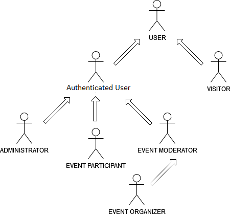
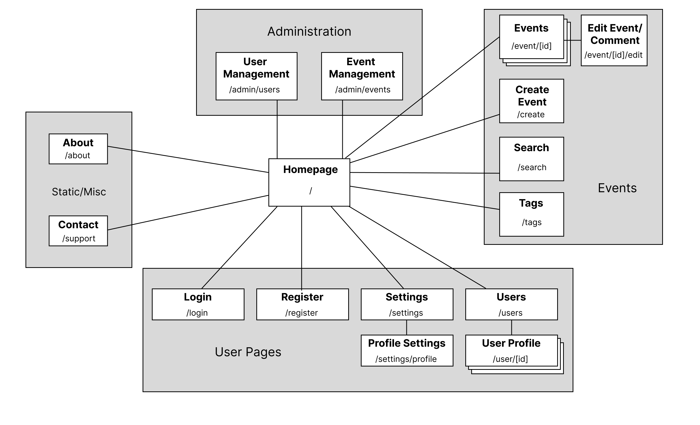

# ER: Requirements Specification Component

## A1: UPorto Event

UPorto Event is a Portugal-based international web service that focuses on creation and development of small and/or large-scale events mostly connected with U.Porto academic life such as student parties, institutional conferences, traditional academic celebrations (Queima das Fitas, Latada and Receção ao Caloiro) as well as unrelatable events, like festivals, ceremonies and concerts developed by 4 students enthusiasts from Universidade do Porto in 2022. 

The main goal of the project is to provide assistance in event creation and management to University of Porto's community. UPorto Event is a centralized service approved by the university officials, also.

Publishing events on our web service is a good way to invite, promote and inform students about the upcoming events.Additionally, the service helps organize non-academic inclusive events for everyone.

Users are separated into groups with different permissions, including:
Visitors, who are allowed to browse and explore the events;
Authenticated Users, who are allowed to create events as well and add comments and create their personal profile;
Administrators who concern themselves with moderating the events and comment sections, detecting/blocking inappropriate behavior. Authenticated Users can create polls in order to get feedback on their events;
All users can browse, view, search and explore events not only by name, but also by venue, organizer or #tags. Users are receiving notifications/reminders of the upcoming event they were registered to.

 The service is claimed to be portable and have responsive design, i.e. to be able to execute on multiple OS and different devices, properly (Android, IOS, Windows, Linux).

Join us!

## A2: Actors and User stories

The current artifact consists of the definition of the actors and their user stories, providing convenient documentation of the project’s requirements.

### 1. Actors

All actors that are implemented in “UPorto Event” web service are represented in the diagram. All information is provided in the table below.

### 2. User Stories

| Role | Description |
| ------ | ------ |
| User | Abstract type of user, that has access to all public information on the service (like accounts and events) |
| Visitor | User that has access only to public events and can register to the system to get more features |
| Authenticated User | Users that can edit information about itself, join public events, create its own, or be invited to private ones. |
| Administrator | Authenticated user, that has access to all accounts and events whose main goal is to keep the service up and help regular users  |
| Event Participant | Authenticated user, that joined a particular event and can vote in polls or submit new content for moderator approval. |
| Event Moderator | Authenticated user, that has special status in a particular event, that gives to him ability to add and edit event’s content. |
| Event Organizer | Creator of the event. Has a simple interface. After the announcement, he can edit the event.  |

#### 2.1. User
|ID | Actor | Name | Priority | Description | Plan Release|
| ------ | ------ | ------ | ----- | ----- | ----- |
| us01 | User | Search | High |As a user, I want to search for public events by name, organizer or tags to join them. | v0.1 |
| us02 | User | View Event | High | As a User, I want to navigate through a specific public event so I can see more detailed information | v0.1 |
| us03 | User | About us | Medium|As a user, I want to access the about page, where I can find a description of the site and its creators. |v0.4|
| us04 | User | FAQ | Medium|As a user, I want to access the FAQ page, where I can get answers to common questions about the site.|v0.4|

#### 2.2. Visistor

|ID | Actor | Name | Priority | Description | Plan Release|
| ------ | ------ | ------ | ----- | ----- | ----- |
|vi01| Visitor | Log In | High | As a visitor, I want to be able to log-in, to get a status of authenticated user. | v0.1|
|vi02| Visitor | Sign Up | High  |As a visitor, I want to be able to create my profile on the site to become an authenticated user. |v0.1|

#### 2.3. Authenticated User

|ID | Actor | Name | Priority | Description | Plan Release|
| ------ | ------ | ------ | ----- | ----- | ----- |
| au01 | Auth. user | Home | High | As an authenticated user, I want to access my home page, where I can see all information about the website. | v0.1 |
| au02 | Auth. user | Events | High | As an authenticated user, I want to see all the events that I participate in, so I can manage them. | v0.1 |
| au03 | Auth. user | Create Event | High | As an authenticated user, I want to create new events by myself to become an event organizer. | v0.1 |
| au04 | Auth. user | Log Out | High | As an authenticated user, I want to be able to log out from service for privacy purposes. | v0.1 |
| au05 | Auth. user | Participate | High | As an authenticated user, I want to show my interest in an event and be able to send a request for participating. | v1.0 |
| au06 | Auth. user | Edit Profile | High | As an authenticated user, I want to edit my profile whenever I please, to keep it up to date.| v0.1 |
| au07 | Auth. user | Delete Profile | High | As an authenticated user, I want to delete my profile if I feel like it. | v0.1 |
| au08 | Auth. user | View Profile | High | As an authenticated user, I want to see my profile and others to check information I want. | v0.1 | 
| au09 | Auth. user | Recover Password | High | As an authenticated user, I want to recover my password in case I can´t remember it. | v0.1 |
| au10 | Auth. user | Preferences | High| As an authenticated user, I want to be able to change my password or customize my notifications, to maintain a comfortable environment on the service for myself.|v0.2|
| au11 | Auth. user | Notifications | Medium | As an autenticated user, I want to recieve notifications about an event that I joined, from an answer to my comment or about my status, so I can stay tuned and connected with the website. | v0.2 |
| au12 | Auth. user | Comment | Medium | As an authenticated user, I want to ask any questions I’d like about an event, even if I'm not a member of this event yet. | v0.2 |
| au13 | Auth. user | Invite | Medium | As an authenticated user, I want to Invite a user to an event, so we can participate together. | v0.2 |

#### 2.3. Event Moderator

|ID | Actor | Name | Priority | Description | Plan Release|
| ------ | ------ | ------ | ----- | ----- | ----- |
| em01 | Moderator | Announcement | Medium | As a moderator of an event, I want to create new announcements on the events page, to inform members about changes in the event. | v0.2 |
| em02 | Moderator | Add/Accept User | Medium | As a moderator, If the event is private, I should be able to add new users and accept them, so more people can join. | v0.3 |
| em03 | Moderator | Create Polls | Medium | As a moderator, I want to create polls about diffrent subjects related to the event, so that out attendes and interact an communicate with the organization in an interactive way | v0.3 |
| em04 | Moderator | Block User | Low |As a moderator, I want to be able to ban users in the particular event, if they improperly behave|v1.0|
| em05 | Moderator | Block Content | Low |As a moderator, I want to remove a comment, so that I can remove inappropriate content in comments. |v1.0|

#### 2.5. Event Organizer

|ID | Actor | Name | Priority | Description | Plan Release|
| ------ | ------ | ------ | ----- | ----- | ----- |
| ee01 | Organizer (Owner) | Event Changes| Medium | As an organizer of an event, I want to be able to edit the details of the event and delete it, to keep all information up to date. | v1.0 |

#### 2.6. Event Participant

|ID | Actor | Name | Priority | Description | Plan Release|
| ------ | ------ | ------ | ----- | ----- | ----- |
| ep01 | event participant | vote in polls | Medium | As a participant of an event, I want to be able to participate in decisions about event and vote in polls, that were created for the members of the event. | v1.0 |

#### 2.7. Administrator

|ID | Actor | Name | Priority | Description | Plan Release|
| ------ | ------ | ------ | ----- | ----- | ----- |
| ad01 | Admin | Delete Event | High | As an administrator, I want to be able to delete events on the site, if they violate the rules of the service. | v1.0 |
| ad02 | Admin | Block, Unblock, Delete | High | As an administrator, I have to be able to block, unblock or delete users accounts so I can manage the site properly and resist potential user violations. | v1.0 |
| ad03 | Admin | Message | Low | As an administrator, I want to be able to write to users via their home pages, to warn them about violation of the rules or answer their questions regarding the use of the service. | v1.1 |

### 3. Supplementary Requirements

> Section including business rules, technical requirements, and restrictions.  
> For each subsection, a table containing identifiers, names, and descriptions for each requirement.

#### 3.1. Business rules

| ID | Name | Description |
| ------ | ------ | ----- |
| BR01 | Date/Time Consistency | Account registration date should be before account deletion date |
| BR02 | Deleted Account |Upon account deletion , shared user data(i.e. events, comments)is kept but made anonymous|
| BR03 | Admin Account |Administrators can comment on events. They Can´t participate ou create events|
| BR04 | Public&Private | Events can be public or private|
| BR05 | Private Events | Private Events don´t appear on the search results|
| BR06 | Types of events |In this site only U.Porto Events can be published and nothing outside of academic related events is allowed.|
| BR07 | Creation of the event |Only U.Porto members are allowed to create an event.|

#### 3.2. Technical requirements

| ID | Name | Description |
| ------ | ------ | ----- |
| TR01 | __User Privacy__ |The system must protect users sensitive data from internal data professionals and employees|
| TR02 | __Accessibility__ |The system must ensure that everyone can access the pages|
| TR03 | __Performance__ |The system should have response times shorter than 2s to ensure the user's attention|
| TR04 | Robustness |The system must be prepared to handle and continue operating when runtime errors|
| TR05 | Data Quality |The system must have excellent data quality, such as the events from the users, we must ensure that such events exist|
| TR06 | Scalability |The system must be prepared to deal with the increasing number of users and respective actions|

#### 3.3. Restrictions

| ID | Name | Description |
| ------ | ------ | ----- |
| ER01 | Deadline of the project | Deadline for project delivery is the end of the study semester - 15th of January|

---

## A3: Information Architecture

In this Artifact we achieve to give a good base to our website in terms of structure and logical requirements. Here we are giving you a more graphic way to represent our site.

### 1. Sitemap

UPorto events will have 4 main areas. The Home Page where visitors and authenticated users can explore as many public events as they want. Then, each authenticated user will have their own Profile Page with their personal public information and some other small features, which includes editing. Besides, any authenticated user can become an event organizer or participant when the event is created. The Event Page is created after the filling of details related to the event. Last but not least administrators will also have their major permissions.

Here is the Sitemap:

 

### 2. Wireframes

#### UI01: Home Page

This is the Home Page for a visitor
The visitor can browse through events by clicking above each event or searching in the search bar. He can also sign up and log In and check some other information about the site.

 

#### UI02: Authenticated User - Event Page

An event page delivers complete information for the user.
Other than that, each user can show his interest by clicking on the participate button or ask some specific questions, so event moderators can answer.

---

## Revision history

Changes made to the first submission:

9/10/2022 Add au07 au08 au09 to the A2 user stories 

18/10/2022  Add us2, au09, au10, au12, em03, BR04 and B405. Edited au1, au2 and BR03. Organized all user stories by priority

19/10/2022 Created participant table (2.6), changed Actors UML, some user stories were reorganized. Changed descriptions of user stories. Old data from table "restrictions" was shifted to business rules and new data was added (according to recommendations).

19/10/2022 ER, A1 components reviewed. David.

***
GROUP21122, 05/10/2021

* João Sousa, up201904739@up.pt    
* Mikhail Ermolaev, up202203498@up.pt
* David Burchakov, up202203777@up.pt
* Válter Castro, up201706546@up.pt
