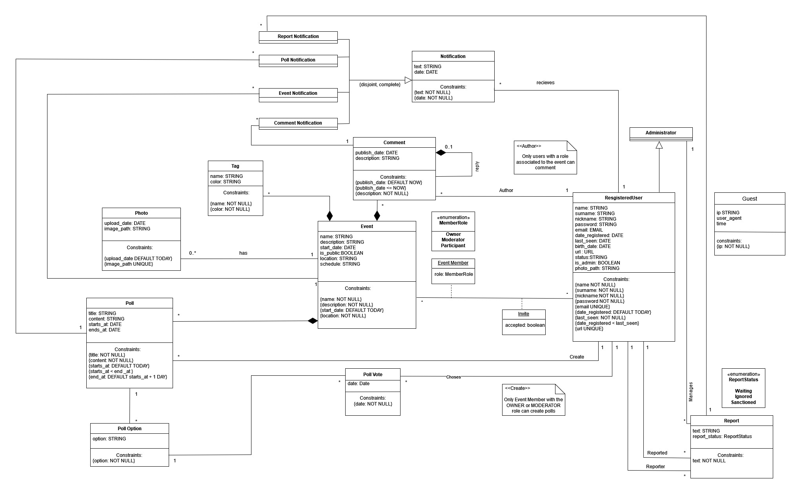

# EBD: Database Specification Component

***UPortoEvent*** will able all students of "Universidade do Porto" to explore all sorts of events inside their academic environment. Therefore in these three artifacts we will present our Database for this project. This way you'll see how your data will be stored.

## A4: Conceptual Data Model

In A4 we will take over our first database topic. This will cover the **Class Diagram** which compiles all entities, attributes and relations of our database, in order to stre efficiently all website information.

### 1. Class diagram

### 2. Additional Business Rules
 
- BR01 : Only registred users who participate on the event can make comments and answer to polls.
- BR02 : Only event creators can delete or cancel the event. So event moderators, can´t.
- BR03 : Only Participants of an specific event can vote in polls
---

## A5: Relational Schema, validation and schema refinement

In A5 we are going to interpretate de UML diagram into the Relational Schema, so that SQL code turns out better. This more specific model represets out data base less abstract in a more concise way.

### 1. Relational Schema

| Relation reference | Relation Compact Notation                        |
| ------------------ | ------------------------------------------------ |
| R01                | authorised_user(<ins>user_id</ins>, name **NN**, surname **NN**, nickname **NN**, password **NN**, email **UK** **NN**, date_registered, last_seen **NN**, birth_date **NN**, url **UK** **NN**, status, is_admin, photo_path ) |
| R02                | event(<ins>event_id</ins>, name **NN**, descriprion **NN**, start_date **NN**, location **NN**, schedule **NN**, role **DF** 'participant' **CK** (role **IN** member_role)) ) |
| R03                | notification(<ins>notification_id</ins>, text **NN**, date **NN**, #user_id → authorised_user **NN** ) |
| R04                | photo(<ins>photo_id</ins>, upload_date **NN**, image_path **NN**, #event_id → Event ) |
| R05				 | poll(<ins>poll_id</ins>, title **NN**, content **NN**, start_date **NN**, end_date **NN**, #user_id → authorised_user **NN**, #event_id → event **NN** ) |
| R06				 | poll_option(<ins>poll_option_id</ins>, option **NN**, #poll_id → poll **NN**) |
| R07   			 | comment(<ins>comment_id</ins>, publish_date **NN**, description **NN**, #comment_id → comment **NN**, #event_id → event **NN**, #user_id → authorised_user **NN** ) |
| R08    			 | tag(<ins>tag_id</ins>, name **NN**, color **NN**, #event_id → event **NN** ) |
| R09  			     | poll_vote(<ins>vote_id</ins>, date **NN**, #user_id → authorised_user **NN**, #poll_option_id → poll_option **NN** ) |
| R10 				 | report(<ins>report_id</ins>, text **NN**, report_status **DF** 'waiting' **CK** (report_status **IN** report_status), report_type **DF** 'Spam' **CK** (report_type **IN** report_type), reported → authorised_user **NN**, reporter → authorised_user **NN**, manages → administrator **NN**) |
| R11                | user_event(<ins>user_id → authorised_user</ins>,<ins>event_id → event</ins>, accepted) |
| R12                | administrator(<ins>#user_id → authorised_user</ins>) |

### 2. Domains

| Domain Name  | Domain Specification           |
| -----------  | ------------------------------ |
| member_role   | ENUM ('owner', 'moderator', 'participant') |
| report_type | ENUM ('Spam', 'Nudity or sexual activity', 'Hate speech or symbols', 'Violence or dangerous organisations', 'Bullying or harassment', 'Selling illegal or regulated goods', 'Scams or fraud', 'False information') |
| report_status | ENUM('waiting', 'ignored', 'sanctioned')|

### 3. Schema validation

| **TABLE R01**   | authorised_user     |
| --------------  | ---                |
| **Keys**        | { user_id }, { email }, {url}  |
| **Functional Dependencies:** |       |
| FD0101          | user_id → {name, surname, nickname, password, email, date_registered, last_seen, birth_date, url, status, is_admin, photo_path} |
| FD0102          | email → {user_id, name, surname, nickname, password, date_registered, last_seen, birth_date, url, status, is_admin, photo_path} |
| FD0103          | url → {user_id, name, surname, nickname, password, email, date_registered, last_seen, birth_date, status, is_admin, photo_path}  |         |
| **NORMAL FORM** | BCNF               |

| **TABLE R02**   | event              |
| --------------  | ---                |
| **Keys**        | {event_id}         |
| **Functional Dependencies:** |       |
| FD0201          | event_id → {name, descriprion, start_date, location, schedule} |
| **NORMAL FORM** | BCNF               |

| **TABLE R03**   | notification       |
| --------------  | ---                |
| **Keys**        | {notification_id}  |
| **Functional Dependencies:** |       |
| FD0301          | notification_id → {text, date, user_id} |
| **NORMAL FORM** | BCNF               |

| **TABLE R04**   | photo              |
| --------------  | ---                |
| **Keys**        | { photo_id}        |
| **Functional Dependencies:** |       |
| FD0401          | photo_id → {upload_date, image_path, event_id} |
| **NORMAL FORM** | BCNF               |

| **TABLE R05**   | poll               |
| --------------  | ---                |
| **Keys**        | { poll_id }        |
| **Functional Dependencies:** |       |
| FD0501          | poll_id → {title, content, start_date, end_date, user_id, event_id} |
| **NORMAL FORM** | BCNF               |

| **TABLE R06**   | poll_option         |
| --------------  | ---                |
| **Keys**        | { poll_option_id }     |
| **Functional Dependencies:** |       |
| FD0601          | poll_option_id → {option, poll_id} |
| **NORMAL FORM** | BCNF               |

| **TABLE R07**   | comments            |
| --------------  | ---                |
| **Keys**        | { comment_id } |
| **Functional Dependencies:** |       |
| FD0701          | comment_id → {publish_date, description, comment_id, event_id, user_id} |
| **NORMAL FORM** | BCNF               |

| **TABLE R08**   | tag                |
| --------------  | ---                |
| **Keys**        | { tag_id } |
| **Functional Dependencies:** |       |
| FD0801          | tag_id → {name, color, event_id} |
| **NORMAL FORM** | BCNF               |

| **TABLE R09**   | poll_vote               |
| --------------  | ---                |
| **Keys**        | { vote_id } |
| **Functional Dependencies:** |       |
| FD0901          | vote_id → {date, user_id, poll_option_id} |
| **NORMAL FORM** | BCNF               |

| **TABLE R10**   | report             |
| --------------  | ---                |
| **Keys**        | { report_id }|
| **Functional Dependencies:** |       |
| FD1001          | report_id → {text, report_status, report_type, reported, reporter, manages} |
| **NORMAL FORM** | BCNF               |

| **TABLE R11**   | user_event         |
| --------------  | ---                |
| **Keys**        | { user_id }, { event_id }  |
| **Functional Dependencies:** |       |
| FD1701          | user_id, member_role, event_id → {accepted} |
| **NORMAL FORM** | BCNF               |

| **TABLE R12**   | administrator      |
| --------------  | ---                |
| **Keys**        | { user_id }        |
| **Functional Dependencies:** |       |
| FD1801          | none               |
| **NORMAL FORM** | BCNF               |

The Schema is already in BCNF. Every relation is in BCNF (Boyce-Codd Normal Form).

## A6: Indexes, triggers, transactions and database population

> This artifact contains information about workload of the  database, the identification and characterisation of the indexes, triggers and transaction to support the data integrity rules and the physical schema of the complete database.

### 1. Database Workload
 
Understanding the potential load on databases and the speed of their growth will help creating well structured and dedicated database design for fast and stable work of the service. Database workload includes an estimate of the number of tuples for each relation and the estimated growth.\
The designation 1+ means several, 10+ means tens, 100+ means hundreds, and so on.

| **Relation reference** | **Relation Name** | **Order of magnitude**        | **Estimated growth** |
| ------------------ | ------------- | ------------------------- | -------- |
| R01  | authorised_user 	| 10.000+   | 10+  |
| R02  | event          	| 1.000+ 	| 1+   |
| R03  | notification   	| 10.000+	| 10+  |
| R04  | photo          	| 10.000+	| 10+  |
| R05  | poll		    	| 1.000+ 	| 1+   |
| R06  | poll_option     	| 1.000+ 	| 1+   |
| R07  | comment        	| 10.000+ 	| 10+ |
| R08  | tag        		| 1000+		| 1+   |
| R09  | vote        		| 1.000+ 	| 1+   |
| R10  | report      		| 100+		| 1+   |
| R11  | user_event    		| 10.000+   | 10+  |
| R12  | administrator      | 10+       | 1+   |

### 2. Proposed Indices

Indexes are used to improve database performance by allowing the database server to work with certain rows much faster. Once an index is created, the system must keep it in sync with the table, which increases the load on data processing operations. Because indexes add to the load on the database system, we should try not to overuse them.

#### 2.1. Performance Indices

Performance indexes are used to improve the performance of individual queries. We should not overuse them, so for the purposes of our project, we will use only three indexes, in areas where they can have the greatest impact. These, in turn, are frequently used tables with a large amount of information.

| **Index**           | IDX01                                  |
| ---                 | ---                                    |
| **Relation**        | authorised_user    							   |
| **Attribute**       | id								   |
| **Type**            | b-tree             					   |
| **Cardinality**     | high                                   |
| **Clustering**      | No                                     |
| **Justification**   | 'authorised_user' table has a huge wokrload. The id field is accessed frequently and has a uuid representation, which mightslow down the searching process. For example, ensures fast counting of the number of all users in the database.     |
| **SQL code**		 | `CREATE INDEX IF NOT EXISTS idx_id_user ON authorized_user USING BTREE(id);`|

| **Index**           | IDX02                                  |
| ---                 | ---                                    |
| **Relation**        | user_event    						   |
| **Attribute**       | event_id							   |
| **Type**            | hash             					   |
| **Cardinality**     | medium                                 |
| **Clustering**      | No                                     |
| **Justification**   | we will use it to search for people from a specific event, during search equality (=) will be used.
-- select user_id from user_event where event_id = 1;       | 
|**SQL code** | `CREATE INDEX IF NOT EXISTS idx_event_user on user_event USING hash(event_id);`|

| **Index**           | IDX03                                            |
| ---                 | ---                                              |
| **Relation**        | poll_vote    							         |
| **Attribute**       | id								         |
| **Type**            | hash             					             |
| **Cardinality**     | medium                                           |
| **Clustering**      | No                                               |
| **Justification**   | lets us count all the votes for a specifit poll. `select select count(*) from poll_vote where poll_id = 1;` equality operator is used, hence the hash index type is suggested.       |
|**SQL code** | `CREATE INDEX IF NOT EXISTS idx_poll_vote on poll_vote USING hash(id);`|

~~~~sql

~~~~
#### 2.2. Full-text Search Indices 

> The system being developed must provide full-text search features supported by PostgreSQL. Thus, it is necessary to specify the fields where full-text search will be available and the associated setup, namely all necessary configurations, indexes definitions and other relevant details.  

| **Index**           | IDX11                                  |
| ---                 | ---                                    |
| **Relation**        | event    |
| **Attribute**       | name, description, location   |
| **Type**            | GIN              |
| **Clustering**      | NO                |
| **Justification**   | To provide full-text search features search for events based on name, description and location. The index type is GIN because the indexed fields are not expected to change often.   |

~~~~
ALTER TABLE event
ADD COLUMN IF NOT EXISTS tsvectors TSVECTOR;

CREATE OR REPLACE FUNCTION event_search_update() RETURNS TRIGGER AS $$
BEGIN
 IF TG_OP = 'INSERT' THEN
        NEW.tsvectors = (
         setweight(to_tsvector('english', NEW.name), 'A') ||
         setweight(to_tsvector('english', NEW.description), 'B') ||
                 setweight(to_tsvector('english', NEW.location), 'C')
        );
 END IF;
 IF TG_OP = 'UPDATE' THEN
         IF (NEW.name <> OLD.name OR NEW.description <> OLD.description OR NEW.location <> OLD.location) THEN
           NEW.tsvectors = (
             setweight(to_tsvector('english', NEW.name), 'A') ||
         setweight(to_tsvector('english', NEW.description), 'B') ||
                 setweight(to_tsvector('english', NEW.location), 'C')
           );
         END IF;
 END IF;
 RETURN NEW;
END $$
LANGUAGE plpgsql;

DROP TRIGGER IF EXISTS event_search_update ON public.event;

CREATE TRIGGER event_search_update
 BEFORE INSERT OR UPDATE ON event
 FOR EACH ROW
 EXECUTE PROCEDURE event_search_update();

DROP INDEX IF EXISTS search_idx_event CASCADE;
CREATE INDEX IF NOT EXISTS search_idx_event ON event USING GIN (tsvectors);

~~~~

| **Index**           | IDX12                                  |
| ---                 | ---                                    |
| **Relation**        | tag    |
| **Attribute**       | name   |
| **Type**            | GIST              |
| **Clustering**      | NO                |
| **Justification**   | To improve overall performance of full-text searches while searching for events by tags; GiST better for dynamic data   |
| **SQL code**        |`CREATE INDEX IF NOT EXISTS idx_tag_name ON tag USING GIST (name);`   ||

### 3. Triggers
 
> User-defined functions and trigger procedures that add control structures to the SQL language or perform complex computations, are identified and described to be trusted by the database server. Every kind of function (SQL functions, Stored procedures, Trigger procedures) can take base types, composite types, or combinations of these as arguments (parameters). In addition, every kind of function can return a base type or a composite type. Functions can also be defined to return sets of base or composite values.  

| **Trigger**      | TRIGGER01                              |
| ---              | ---                                    |
| **Description**  | Sends a notification after user submits a report to assure him it's delivered. |
~~~~ 
CREATE OR REPLACE FUNCTION report_notification() RETURNS trigger AS $report_notification$ 
BEGIN 
	INSERT INTO 
	notification(user_id, notification_type, notification_date, notification_text) 
	select NEW.reporter_id, 'report', NEW.report_date, 'Thank you for your report. 
	We will check information given as fast as possible. Report status: ' || NEW.report_status || ' Message: ' || NEW.report_text from report; 
RETURN new; 
END; 
$report_notification$ 
language plpgsql; 
				
DROP TRIGGER IF EXISTS trig_report ON public.report; 
											
CREATE TRIGGER trig_report					
AFTER INSERT ON report						
FOR EACH ROW								
EXECUTE PROCEDURE report_notification();` 
~~~~

| **Trigger**      | TRIGGER02                              |
| ---              | ---                                    |
| **Description**  | sends a notification after a new poll is created

~~~~
CREATE OR REPLACE FUNCTION poll_notification() RETURNS trigger AS $poll_notification$
BEGIN
	INSERT INTO 
	notification(notification_date, notification_type, user_id, notification_text)
	select NEW.starts_at, 'poll', NEW.user_id, 'New poll was created. ' || NEW.title || ' You can vote!' from poll;
RETURN new;
END;
$poll_notification$
language plpgsql;
				
DROP TRIGGER IF EXISTS trig_poll ON public.poll;

CREATE TRIGGER trig_poll
     AFTER INSERT ON poll
     FOR EACH ROW
     EXECUTE PROCEDURE poll_notification();
~~~~

| **Trigger**      | TRIGGER03                              |
| ---              | ---                                    |
| **Description**  | Sends a notification when a user joins an event. |
~~~~ 
CREATE OR REPLACE FUNCTION event_notification() RETURNS trigger AS $event_notification$
BEGIN
	INSERT INTO 
	notification(notification_text,notification_date, notification_type, user_id)
	VALUES('You have just joined new event, welcome!', CURRENT_TIMESTAMP, 'event', NEW.user_id);
RETURN new;
END;
$event_notification$
language plpgsql;
				
DROP TRIGGER IF EXISTS trig_event ON public.user_event;

CREATE TRIGGER trig_event
     AFTER INSERT OR UPDATE ON user_event
     FOR EACH ROW
     EXECUTE PROCEDURE event_notification();
~~~~

| **Trigger**      | TRIGGER04                              |
| ---              | ---                                    |
| **Description**  | Sends a notification to the creator of a comment when a comment is replied by another user. |
~~~~ 
CREATE OR REPLACE FUNCTION comment_notification() RETURNS trigger AS $comment_notification$
BEGIN
	IF (NEW.parent_comment_id IS NOT NULL)
THEN
	INSERT INTO 
	notification(notification_text,notification_date, notification_type, user_id)
	select NEW.comment_text, NEW.comment_date, 'comment' ,user_id from comments where NEW.parent_comment_id = id;
END IF;
RETURN new;
END;
$comment_notification$
language plpgsql;
				
DROP TRIGGER IF EXISTS trig_comment ON public.comments;

CREATE TRIGGER trig_comment
     AFTER INSERT OR UPDATE ON comments
     FOR EACH ROW
     EXECUTE PROCEDURE comment_notification();
~~~~

### 4. Transactions
 
> Transactions needed to assure the integrity of the data.  

| SQL Reference   | TRAN01                    |
| --------------- | ----------------------------------- |
| Justification   | When user tries to create a new event it's important to use a transaction to ensure that all the code executes without errors. If an error occurs, a ROLLBACK is issued (when the insertion of new event fails or creation of new line in the user_event). The isolation level is Repeatable Read, because, otherwise, there is a chance that event_update table can be changed by other function and as a result, inconsistent data would be stored.  |
| Isolation level | REPEATABLE READ |
| 'in progress'                                   ||

### Annex A. SQL Code
SQL script in included. It cintains the creation statements, cleans up the current database state 'The SQL script is cleaned (e.g. excluded from export comments)' - don't understand what does it mean. Indexes, triggers, transactions and database population - to be provided at A6.

## A.1 Database Schema

The SQL creation script is expanded in the A6 to include indexes, triggers, and transactions.

~~~~sql
-----------------------------------------
-- EXTENSIONS
-----------------------------------------

-- The citext module provides a case-insensitive character string type. 
-- Essentially, it internally calls lower when comparing values.
-- https://www.postgresql.org/docs/current/citext.html
CREATE EXTENSION IF NOT EXISTS citext;

-----------------------------------------
-- DROPPING TABLES
-----------------------------------------
-- CASCADE Automatically drop objects that depend on the table
DROP TABLE IF EXISTS authorized_user CASCADE;
DROP TABLE IF EXISTS administrator CASCADE;
DROP TABLE IF EXISTS event CASCADE;
DROP TABLE IF EXISTS report CASCADE;
DROP TABLE IF EXISTS user_event CASCADE;
DROP TABLE IF EXISTS comments CASCADE;
DROP TABLE IF EXISTS notification CASCADE;
DROP TABLE IF EXISTS tag CASCADE;
DROP TABLE IF EXISTS photo CASCADE;
DROP TABLE IF EXISTS poll CASCADE;
DROP TABLE IF EXISTS poll_option CASCADE;
DROP TABLE IF EXISTS poll_vote CASCADE;

-----------------------------------------
-- TYPES
-----------------------------------------
drop type if exists REPORT_STATUS;
CREATE TYPE REPORT_STATUS AS ENUM('Spam', 'Nudity or sexual activity', 'Hate speech or symbols', 'Violence or dangerous organisations', 'Bullying or harassment', 'Selling illegal or regulated goods', 'Scams or fraud', 'False information');

drop type if exists MEMBER_ROLE;
CREATE TYPE MEMBER_ROLE AS ENUM('Owner', 'Moderator', 'Participant');

drop type if exists TYPE_NOTIFICATION;
CREATE TYPE TYPE_NOTIFICATION AS ENUM('comment', 'event', 'poll', 'report');

-----------------------------------------
-- TABLES
-----------------------------------------

CREATE TABLE IF NOT EXISTS authorized_user(
    ID uuid DEFAULT uuid_generate_v4 () PRIMARY KEY,
    name TEXT DEFAULT 'name' NOT NULL,
    surename TEXT DEFAULT 'family name' NOT NULL,
    nickname TEXT UNIQUE NOT NULL,
    password TEXT DEFAULT sha256('DEFAULT_password') NOT NULL,
    email citext UNIQUE NOT NULL,
    date_registered TIMESTAMP DEFAULT CURRENT_TIMESTAMP NOT NULL,
    last_seen TIMESTAMP,
    birth_date DATE DEFAULT (current_date - INTERVAL '18 YEAR') CHECK (
        birth_date <= (current_date - INTERVAL '18 YEAR')
    ),
    url TEXT UNIQUE,
    status TEXT,
    is_admin BOOLEAN DEFAULT false NOT NULL,
    photo_path TEXT
);

CREATE TABLE IF NOT EXISTS administrator(
    id SERIAL PRIMARY KEY,
    admin_id uuid,
    FOREIGN KEY (admin_id) REFERENCES authorized_user(id)
);

CREATE TABLE IF NOT EXISTS event(
    id SERIAL PRIMARY KEY,
    name TEXT DEFAULT 'DEFAULT name' NOT NULL,
    description TEXT DEFAULT('FEUP party') NOT NULL,
    start_date TIMESTAMP DEFAULT (
        to_timestamp('05 Dec 2023 22:00', 'DD Mon YYYY HH24:MI')
    ) NOT NULL,
    is_public BOOLEAN DEFAULT TRUE NOT NULL,
    location TEXT DEFAULT 'Adega Leonor' NOT NULL
);

CREATE TABLE IF NOT EXISTS report(
    id SERIAL PRIMARY KEY,
    reported_id uuid,
    reporter_id uuid,
    admin_id INT,
    report_text TEXT NOT NULL,
		report_date TIMESTAMP DEFAULT (CURRENT_TIMESTAMP),
    report_status REPORT_STATUS,
    FOREIGN KEY (reported_id) REFERENCES authorized_user(id),
    FOREIGN KEY (reporter_id) REFERENCES authorized_user(id),
    FOREIGN KEY (admin_id) REFERENCES administrator(id)
);

CREATE TABLE IF NOT EXISTS user_event(
    id SERIAL PRIMARY KEY,
    user_id uuid,
    event_id INT,  
    role MEMBER_ROLE,
    accepted BOOLEAN,   -- used only in private events
    UNIQUE (user_id, event_id),  -- combination of user_id and event_id is UNIQUE because user can be registered at the event only once
    FOREIGN KEY (user_id) REFERENCES authorized_user(id),
    FOREIGN KEY (event_id) REFERENCES event(id)
);

-- word "comments" was used because "comment" is a reserved word in PostgreSQL 
-- inspirations: https://stackoverflow.com/questions/55074867/posts-comments-replies-and-likes-database-schema
CREATE TABLE IF NOT EXISTS comments(
    id SERIAL PRIMARY KEY,
    comment_text TEXT DEFAULT ('Great event!'),
    user_id uuid,
    event_id INT,
    parent_comment_id INT DEFAULT NULL, -- null if a new comment and comment_id of the parent if a reply
    comment_date DATE DEFAULT (current_date) CHECK (comment_date <= current_date),
		FOREIGN KEY (user_id, event_id) REFERENCES user_event (user_id, event_id),     -- double reference 
		FOREIGN KEY (parent_comment_id) REFERENCES comments(id)
);

CREATE TABLE IF NOT EXISTS notification(
    id SERIAL PRIMARY KEY,
		user_id uuid,
		notification_type type_notification NOT NULL,
    notification_text TEXT NOT NULL DEFAULT ('text'),
    notification_date DATE NOT NULL DEFAULT (current_date) CHECK (notification_date <= current_date),
    FOREIGN KEY (user_id) REFERENCES authorized_user(id)
);

CREATE TABLE IF NOT EXISTS tag(
    id SERIAL PRIMARY KEY,
    name TEXT NOT NULL,
    color TEXT NOT NULL,
    event_id INT,
    FOREIGN KEY (event_id) REFERENCES event(id)
);

CREATE TABLE IF NOT EXISTS photo(
    id SERIAL PRIMARY KEY,
    upload_date DATE DEFAULT (current_date),
    image_path TEXT UNIQUE,
    event_id INT,
    FOREIGN KEY (event_id) REFERENCES event(id)
);

CREATE TABLE IF NOT EXISTS poll(
    id SERIAL PRIMARY KEY,
    title TEXT NOT NULL,
    content TEXT NOT NULL,
    starts_at TIMESTAMP DEFAULT CURRENT_TIMESTAMP check(starts_at <= CURRENT_TIMESTAMP) NOT NULL,
    end_at TIMESTAMP DEFAULT (CURRENT_TIMESTAMP + INTERVAL '1 DAY') check(end_at > starts_at) NOT NULL,
    event_id INT,
    FOREIGN KEY (event_id) REFERENCES event(id)
);

CREATE TABLE IF NOT EXISTS poll_option(
    id SERIAL PRIMARY KEY,
    option TEXT NOT NULL,
    poll_id INT,
    FOREIGN KEY (poll_id) REFERENCES poll(id)
);

CREATE TABLE IF NOT EXISTS poll_vote(
    vote_id SERIAL PRIMARY KEY,
    user_id uuid,
		event_id INT,
    option_id INT,
    date DATE NOT NULL,
    FOREIGN KEY (vote_id) REFERENCES poll(id),
    FOREIGN KEY (user_id, event_id) REFERENCES user_event (user_id, event_id),     -- double reference 
    FOREIGN KEY (option_id) REFERENCES poll_option(id)
);

-----------------------------------------
-- TRIGGERS
-----------------------------------------

CREATE OR REPLACE FUNCTION comment_notification() RETURNS trigger AS $comment_notification$
		BEGIN
		IF (NEW.parent_comment_id IS NOT NULL)
			THEN
				INSERT INTO 
							notification(notification_text,notification_date, notification_type, user_id)
							select NEW.comment_text, NEW.comment_date, 'comment' ,user_id from comments where NEW.parent_comment_id = id;
			 END IF;
							RETURN new;
END;
$comment_notification$
language plpgsql;
				
DROP TRIGGER IF EXISTS trig_comment ON public.comments;

CREATE TRIGGER trig_comment
     AFTER INSERT OR UPDATE ON comments
     FOR EACH ROW
     EXECUTE PROCEDURE comment_notification();
		 
		 
		 
		 
CREATE OR REPLACE FUNCTION event_notification() RETURNS trigger AS $event_notification$
		BEGIN
				INSERT INTO 
							notification(notification_text,notification_date, notification_type, user_id)
							VALUES('You have just joined new event, welcome!', CURRENT_TIMESTAMP, 'event', NEW.user_id);
							RETURN new;
END;
$event_notification$
language plpgsql;
				
DROP TRIGGER IF EXISTS trig_event ON public.user_event;

CREATE TRIGGER trig_event
     AFTER INSERT OR UPDATE ON user_event
     FOR EACH ROW
     EXECUTE PROCEDURE event_notification();
		 
		 
		 
CREATE OR REPLACE FUNCTION poll_notification() RETURNS trigger AS $poll_notification$
		BEGIN
				INSERT INTO 
							notification(notification_date, notification_type, user_id, notification_text)
							select NEW.starts_at, 'poll', NEW.user_id, 'New poll was created. ' || NEW.title || ' You can vote!' from poll;
							RETURN new;
END;
$poll_notification$
language plpgsql;
				
DROP TRIGGER IF EXISTS trig_poll ON public.poll;

CREATE TRIGGER trig_poll
     AFTER INSERT ON poll
     FOR EACH ROW
     EXECUTE PROCEDURE poll_notification();

CREATE OR REPLACE FUNCTION report_notification() RETURNS trigger AS $report_notification$
		BEGIN
				INSERT INTO 
							notification(user_id, notification_type, notification_date, notification_text)
							select NEW.reporter_id, 'report', NEW.report_date, 'Thank you for your report. We will check information given as fast as possible. Report status: ' || NEW.report_status || ' Message: ' || NEW.report_text from report;
							RETURN new;
END;
$report_notification$
language plpgsql;
				
DROP TRIGGER IF EXISTS trig_report ON public.report;

CREATE TRIGGER trig_report
     AFTER INSERT ON report
     FOR EACH ROW
     EXECUTE PROCEDURE report_notification();

-----------------------------------------
-- Indeces
-----------------------------------------
DROP INDEX IF EXISTS idx_id_user CASCADE;
CREATE INDEX IF NOT EXISTS idx_id_user ON authorized_user USING BTREE(id);

DROP INDEX IF EXISTS idx_event

DROP INDEX IF EXISTS idx_notification CASCADE;
CREATE INDEX IF NOT EXISTS idx_notification ON notification USING BTREE(notification_date);
		 
~~~~~

### A.2. Database population

> Only a sample of the database population script may be included here, e.g. the first 10 lines. The full script must be available in the repository.

---

## Revision history

1. A6-1 was changed.
2. All names were changed according to the underscore notation (name, long_name). registered_user was chaged to authorised_user
3. report/comment/poll/event notification-tables were removed - added triggers instead. Guests-table removed.  David. 
4. UML simplified, indexes started.
5. Added description to many items. Added 6 new indexes (the description of some indexes needs improvement). Existing indexes are also left.
***
GROUP21122, 12/10/2022

* João Sousa, up201904739@up.pt    
* Mikhail Ermolaev, up202203498@up.pt
* David Burchakov, up202203777@up.pt
* Válter Castro, up201706546@up.pt
