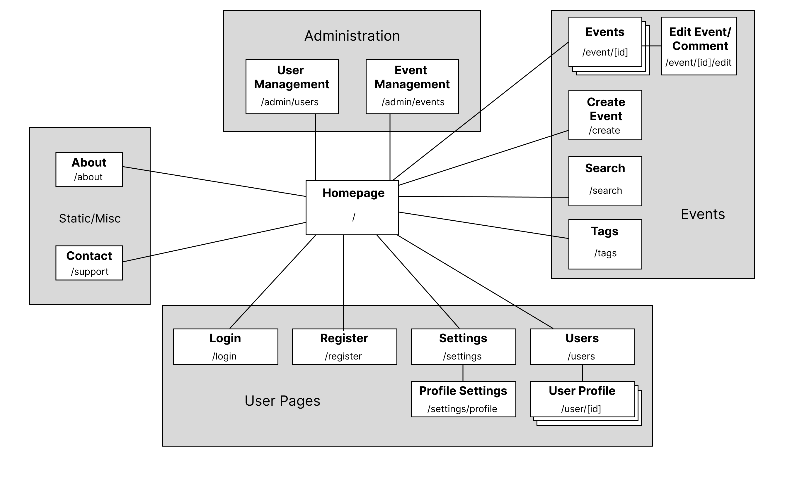
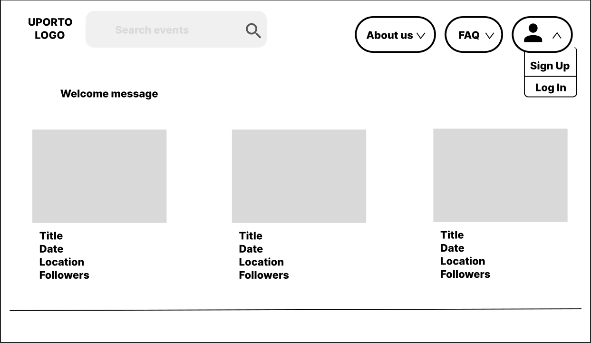
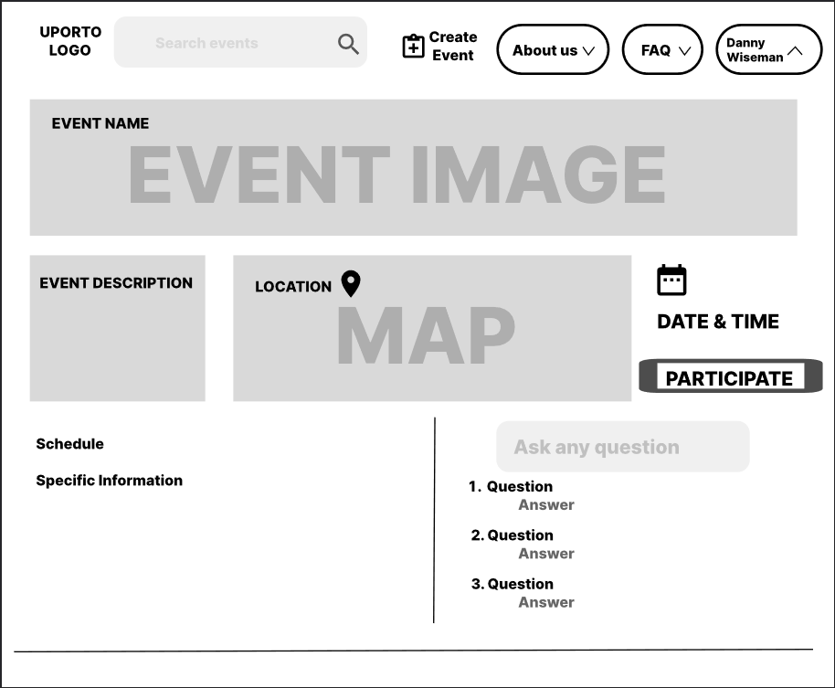

# ER: Requirements Specification Component

## A1: UPorto Event

UPorto Event is a Portugal-based international web service that focuses on creation and development of small and/or large-scale events mostly connected with U.Porto academic life such as student parties, institutional conferences, traditional academic celebrations (Queima das Fitas, Latada and Receção ao Caloiro) as well as unrelatable events, like festivals, ceremonies and concerts developed by 4 students enthusiasts from Universidade do Porto in 2022. 

The main goal of the project is to provide assistance in event creation and management to University of Porto's community. UPorto Event is a centralized service approved by the university officials, also.

Publishing events on our web service is a good way to invite, promote and inform students about the upcoming events.Additionally, the service helps organize non-academic inclusive events for everyone.

Users are separated into groups with different permissions, including:
- Visitors, who are allowed to browse and explore the events;
- Authenticated Users, who are allowed to create events as well and add comments and create their personal profile;
- Administrators who concern themselves with moderating the events and comment sections, detecting/blocking inappropriate behavior.
- All users can browse, view, search and explore events not only by name, but also by venue, organizer or #tags.

 The service is claimed to be portable and have responsive design, i.e. to be able to execute on multiple OS and different devices, properly (Android, IOS, Windows, Linux). It was announced that the developers are intending to add a chatbot to assist clients.

Join us!

## A2: Actors and User stories

Artifact 2 engages in the relation between actors and their user stories.

### 1. Actors

All actors that are implemented in “UPorto Event” web service are represented in the diagram. All information is provided in the table below.

### 2. User Stories

| Role | Description |
| ------ | ------ |
| User | Abstract type of user, that has access to public accounts and events |
| Visitor | User that has access only to public information and can register to the system |
| Authenticated User | Users that can edit information about itself, join public events, create its own, or be invited to private ones. |
| Administrator | Authenticated user, that has access to all accounts and events whose main goal is to keep the service up and help regular users  |
| Event Participant | Authenticated user, that joined a particular event and can write comments or submit new content for moderator approval. |
| Event Moderator | Authenticated user, that has special status in a particular event, that gives to him ability to add and edit event’s content. |
| Event Organizer | Has a simple, stylish interface. After the announcement, he can edit the event.  |

#### 2.1. User
|ID | Actor | Name | Priority | Description | Plan Release|
| ------ | ------ | ------ | ----- | ----- | ----- |
|us01| User | Search | High |As a user, I want to search for events by name or organizer.|v0.1|
|us02| User | Preferences | High| As a user, I want to be able to change my password or customize my notifications.|v0.2|
|us03| User | About us | medium|As a user, I want to access the about page, where I can find a description of the site and its creators. |v0.4|
|us04| User | FAQ | medium|As a user, I want to access the FAQ page, where I can get answers to common questions about the site.|v0.4|

#### 2.2. Visistor

|ID | Actor | Name | Priority | Description | Plan Release|
| ------ | ------ | ------ | ----- | ----- | ----- |
|vi01| Visitor | Log In | High | As a visitor, I want to be able to log-in.| v0.1|
|vi02| Visitor | Sign Up | High  |As a visitor, I want to be able to create my profile on the site. |v0.1|

#### 2.3. Authenticated User

|ID | Actor | Name | Priority | Description | Plan Release|
| ------ | ------ | ------ | ----- | ----- | ----- |
| au01 | Auth. user |Home|High|As an authenticated user, I want to access my home page, where I can see all information about myself.||
| au02 | Auth. user |Events|High|As an authenticated user, I want to see all the events that I participate in.||
| au03 | Auth. user |Create Event|High|As an authenticated user, I want to create new events by myself.||
| au04 | Auth. user |Log Out|High|As an authenticated user, I want to be able to log out.||
| au05 | Auth. user |Comment|High|As an authenticated user, I want to ask any questions I’d like about an event||
| au06 | Auth. user |Participate|High|As an authenticated user, I want to show my interest in an event and participate in it.||

#### 2.3. Event Moderator

|ID | Actor | Name | Priority | Description | Plan Release|
| ------ | ------ | ------ | ----- | ----- | ----- |
| em01 | Moderator |announcement|medium|As a moderator of an event, I want to create new announcements on the events page.|v0.2|
| em02 | Moderator |block user|low|I want to be able to ban users in the particular event, if they improperly behave|v1.0|
| em03 | Moderator |block content|low|I want to remove a comment, so that I can remove inappropriate content|v1.0|
| em04 | Moderator |accept user|medium|If the event is private, I should be able to add new users.|v0.3|

#### 2.5. Event Organizer

|ID | Actor | Name | Priority | Description | Plan Release|
| ------ | ------ | ------ | ----- | ----- | ----- |
| ee01 | Organizer | Event Changes| medium |As an organizer of an event, I want to be able to edit the description of the event or delete it.||

#### 2.6. Administrator

|ID | Actor | Name | Priority | Description | Plan Release|
| ------ | ------ | ------ | ----- | ----- | ----- |
| ad01 | Admin | message|low|As an admin, I want to be able to write to users via their home pages.|v1.1|
| ad02 | Admin | ban |high|As an admin, I want to be able to ban users or events on the site, if they violated the rules of the service.|v1.0|

### 3. Supplementary Requirements

> Section including business rules, technical requirements, and restrictions.  
> For each subsection, a table containing identifiers, names, and descriptions for each requirement.

#### 3.1. Business rules

| ID | Name | Description |
| ------ | ------ | ----- |
| BR01 | Date/Time Consistency | Account registration date should be before account deletion date |
| BR02 | Deleted Account |Upon account deletion , shared user data(i.e. events, comments)is kept but made anonymous|
| BR03 | Admin Account |Administrators can comment on events|

#### 3.2. Technical requirements

| ID | Name | Description |
| ------ | ------ | ----- |
| TR01 | Data Quality |The system must have excellent data quality, such as the events from the users, we must ensure that such events exist|
| TR02 | User Privacy |The system must protect users sensitive data from internal data professionals and employees|
| TR03 | Accessibility |The system must ensure that everyone can access the pages|
| TR04 | Scalability |The system must be prepared to deal with the increasing number of users and respective actions|
| TR05 | Robustness |The system must be prepared to handle and continue operating when runtime errors|
| TR06 | Performance |The system should have response times shorter than 2s to ensure the user's attention|

#### 3.3. Restrictions

| ID | Name | Description |
| ------ | ------ | ----- |
| ER01 | EVENT TYPE |In this site only U.Porto Events can be published and nothing outside of academic related events is allowed.|
| ER02 | EVENT CREATION |Only U.Porto members are allowed to create an event.|

---

## A3: Information Architecture

In this Artifact we achieve to give a good base to our website in terms of structure and logical requirements. Here we are giving you a more graphic way to represent our site.

### 1. Sitemap

UPorto events will have 4 main areas. The Home Page where visitors and authenticated users can explore as many public events as they want. Then, each authenticated user will have their own Profile Page with their personal public information and some other small features, which includes editing. Besides, any authenticated user can become an event organizer or participant when the event is created. The Event Page is created after the filling of details related to the event. Last but not least administrators will also have their major permissions.

Here is the Sitemap:

 

### 2. Wireframes

#### UI01: Home Page

This is the Home Page for a visitor
The visitor can browse through events by clicking above each event or searching in the search bar. He can also sign up and log In and check some other information about the site.

 

#### UI02: Authenticated User - Event Page

An event page delivers complete information for the user.
Other than that, each user can show his interest by clicking on the participate button or ask some specific questions, so event moderators can answer.

---

## Revision history

Changes made to the first submission:

***
GROUP21122, 05/10/2021

* João Sousa, up201904739@up.pt    
* Mikhail Ermolaev, up202203498@up.pt
* David Burchakov, up202203777@up.pt
* Válter Castro, up201706546@up.pt
